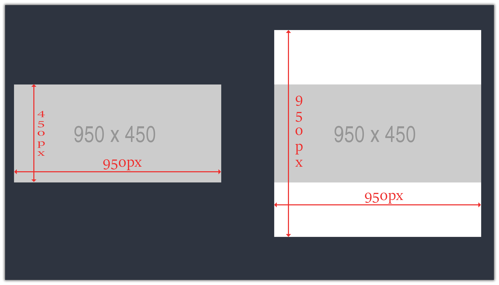

# Square Fit Image
[]()
[]()
[]()
[]()

This script allows user to add white color (can be changed via code) to a directory containing images and resize them to square shape, without stretching or diminishing them! (Recursive, not checked)

For example, if I have an image thats 1920x1080 (ie. in landscape), this script will add white borders automatically to top and bottom to make it 1920x1920 (ie. the bigger of the two dimensions). Pretty Neat.

---

### Prerequisites
You must have PIL or Pillow installed. To install it using pip, use the code below:
```
pip install pillow
```

---

### Usage
Run the script and enter the absoulute path of directory that contains the image. If the script finds an image it will be converted and stored in a folder named 'converted' inside the entered path.

---

### Screenshots
Left image is original and right one is converted!


